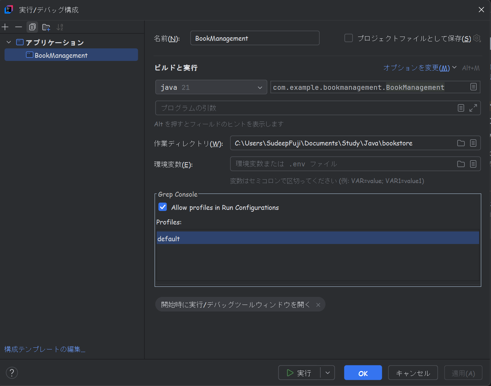

# 書籍管理システム
本プロジェクトは簡単なバックエンドの実装です。このプロジェクトはただ詳細設計書の書き方の練習のためを作成した。

## 実行ビルド構成の設定するため、Intellij　Ideaで、以下の設定を行ってください。
1. Intellij IdeaでCloneされたフォルダを開く
2. Intellij　Ideaの左上のメニューにある「現在のファイル🔽」というボータンをクリックをして、
   構成の編集ボタンを表示されたら、 そこをクリックをしたら実行/デバッグ構成がポップアップ が出ます。
3. 左上の「＋」ボタンをクリックをして、「新規構成を追加」を表示されます。
   そこからアプリケーションを選んでください。
4. 以下のように設定
   名前:　BookManagement</br>
   ビルドと実行：</br>
   Java盤：21</br>
   メインクラス：com.example.bookmanagement.BookManagement</br>
   使用するモジュール：BookManagement

5. 適用をクリックをして、OKをクリックをしてください。
6. Intellij Ideaの右上の実行ボタンをクリックをして、アプリケーションを実行してください。
   例：
   


## 注意点：
1. Mavenがインストールされていることを確認してください。
2. Java 21がインストールされていることを確認してください。
3. プロジェクトの依存関係が正しく解決されていることを確認してください。

本ポロジェクトを実行する方法：
Git clone をするコマンド：
```
git clone git@github.com:SudeepSubediFuji/Book.git
```
そこのフォルダパスにタミヤで入って、以下のコマンドを実行してください。
```
# ビルドコマンド
mvn clean install
```